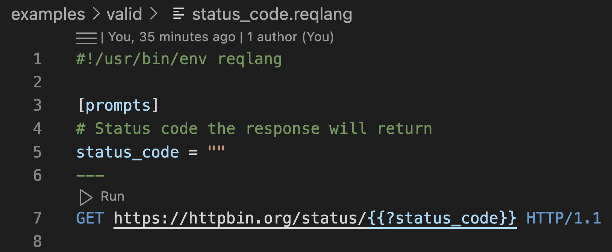
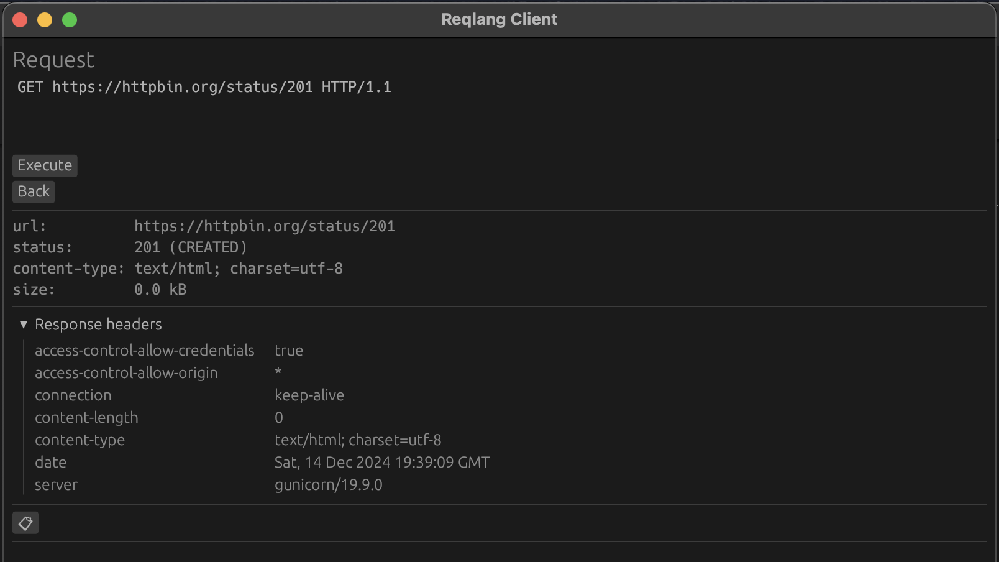

# Request Language

[Github](https://github.com/testingrequired/reqlang)

A file format specification for defining HTTP requests, response assertions, and associated data/configuration in "request files".

## Goals

- HTTP request and response messages
- Easy to read, write, and diff
- Lives in source control
- Environments
- Templating with variables, prompted, and secret values
- Client/implementation agnostic

### Future

- Chaining requests
- Response body mapping/transformation/extraction
- Authenticated requests (e.g. OAuth2) configuration
- Project workspaces

## Request Files

Request files (`*.reqlang`) are multi-document files containing a request along with an optional config and expected response. They are designed to define what the request is, not how to execute it (e.g. defining what secrets are needed instead of how to fetch them). This is left to implementing clients.

### Living Syntax

This is a living syntax subject to change wildly at anytime. The core concepts and goals will remain the same however.

#### Future

- Alternative syntax to document delimiters `---`

### Example

[post.reqlang](./examples/valid/post.reqlang):

```reqlang
vars = ["test_value"]
secrets = ["super_secret_value"]

[prompts]
prompt_value = ""

[envs.test]
test_value = "test_value"

[envs.prod]
test_value = "prod_value"

[envs.local]
test_value = "local_value"

---
POST https://httpbin.org/post HTTP/1.1

{
  "env": "{{@env}}",
  "value": "{{:test_value}}",
  "prompted_value": "{{?prompt_value}}",
  "secret_value": "{{!super_secret_value}}"
}
```

### Request

The request is the request is what's executed when the request file is ran. They are written as [HTTP request messages](https://developer.mozilla.org/en-US/docs/Web/HTTP/Messages#http_requests).

```reqlang
---
GET https://example.com HTTP/1.1
```

### Response

The response is optional but treated as an assertion if it is defined. When the request is executed, this response is compared to the actual response received.

```reqlang
---
GET https://example.com HTTP/1.1
---
HTTP/1.1 200 OK
```

#### Matching Rules

Client implementations can choose how to match the response against the expected response. Here are a list of recommended ways to match.

- Exact match `status code`
- Exact match `status text`
- Exact match `header value` of headers present in the expected response
- Exact match `body`
- Wildcard match `header value` and `body` using the `{{*}}` template references.

### Configuration

The configuration is optional but is used to define environment names and their variables as well as what prompts & secrets are needed. It currently uses the `toml` syntax.

#### Variables & Environments

Variables contain environmental variables that can be used in the request or response. A list of variable names is first declared.

Variables can be templated using the `{{:var_name}}` syntax. The environment of the request execution can be referenced using the `{{@env}}` syntax.

```toml
vars = ["user_id", "item_id"]
```

Then enviroments are declared with the appropriate values.

```toml
vars = ["user_id", "item_id"]

[envs.dev]
user_id = 12345
item_id = "abcd"

[envs.prod]
user_id = 67890
item_id = "efgh"
```

There is an implicitly defined `default` environment present but it still must be declared in the config.

```toml
vars = ["user_id"]

[envs.default]
user_id = 12345
```

##### Usage

```reqlang
vars = ["user_id", "item_id"]

[envs.dev]
user_id = 12345
item_id = "abcd"

[envs.prod]
user_id = 67890
item_id = "efgh"
---
GET https://{{@env}}.example.com/users/{{:user_id}}/items/{{:item_id}} HTTP/1.1
```

##### Goals

- Clearly define everything the request and response will need
- Declare environments once
- Require variable declaration before definition

###### Future

- Default value (implicitly set in the `default` environment)
- Value type

#### Prompts

Prompts are values provided by the user at request execution time. These are "inputs" to the request file. They can be templated in the request and responses using the `{{?prompt_name}}` syntax.

```toml
[prompts]
tags = ""
```

##### Usage

```reqlang
[prompts]
tags = ""
---
GET https://example.com/posts?tags={{?tags}} HTTP/1.1
```

##### Future

- Default value
- Value type

#### Secrets

Secrets are protected values referenced by a name and declares what secrets will be required. How secret values are fetched is up to client implementations. They can be referenced using the `{{!secret_name}}` syntax.

```toml
secrets = ["api_key"]
```

##### Usage

```reqlang
secrets = ["api_key"]
---
GET https://example.com HTTP/1.1
x-api-key: {{!api_key}}
```

##### Goals

- Secret fetching is outside the scope of the request file

###### Future

- Configuring secret fetching in the workspace

### Examples

See [all examples](./examples) for more request files.

## Tooling

[](https://github.com/testingrequired/reqlang/actions/workflows/build-artifacts.yml)

These act as both tooling for request file and reference implementations for clients.

### CLI

The [`reqlang`](./cli) CLI validates and exports requests in to a variety of formats (`http`, `curl`).

#### Validating

```shell
reqlang validate ./examples/valid/status_code.reqlang

# Valid!
```

#### Exporting

```shell
reqlang export ./examples/valid/status_code.reqlang -P status_code=201

# GET https://httpbin.org/status/201 HTTP/1.1
```

### CLI in Docker

The `reqlang` CLI can be run from a docker image.

#### Building

```shell
docker build -t reqlang:0.1.0 .
```

#### Running

A directory of request files can be mounted inside the container's `/usr/local/src` directory to make them accessible.

```shell
docker run --rm --read-only \
    -v "/$PWD/examples":/usr/local/src/examples:ro \
    reqlang:0.1.0 \
    export \
    ./examples/valid/delay.reqlang \
    -f curl \
    -P seconds=5 | bash

# HTTP/1.1 201 CREATED
# Date: Sat, 14 Dec 2024 19:20:26 GMT
# Content-Type: text/html; charset=utf-8
# Content-Length: 0
# Connection: keep-alive
# Server: gunicorn/19.9.0
# Access-Control-Allow-Origin: *
# Access-Control-Allow-Credentials: true
```

### VS Code

The [VS Code extension](./vsc/#readme) acts as an in-editor REST client.



### Desktop Client

The [desktop client](./reqlang-client) is a very simple GUI written in [egui](https://github.com/emilk/egui). It's mostly used for testing.



## Contributing

Please see [CONTRIBUTING.md](./CONTRIBUTING.md) for details on how to contribute.
